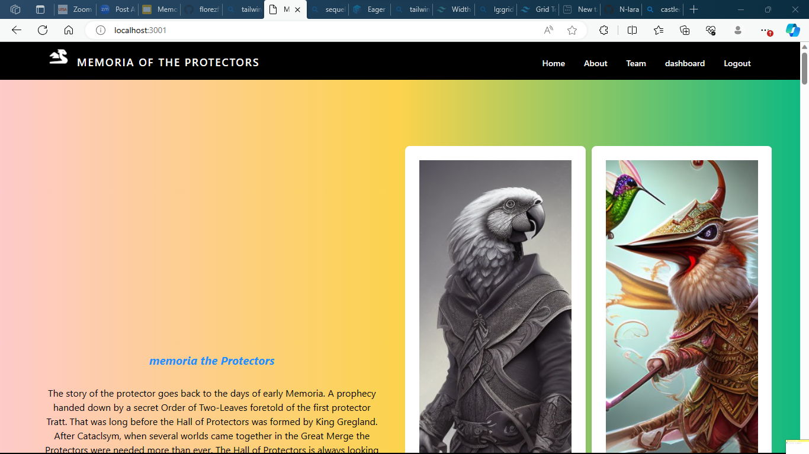
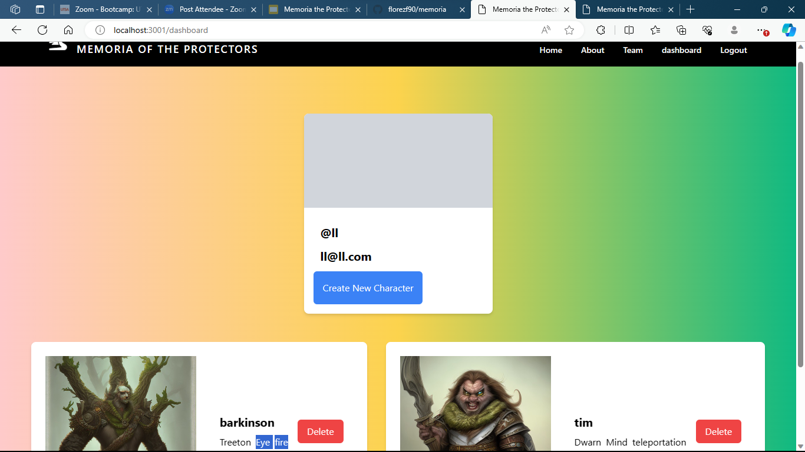

<h1 align= "center" id="title">Memoria the protectors</h1>

 

<h1>👩‍💻 About </h1>

### Introducing Memoria: The Protectors, a brand-new Tabletop Role-Playing Game (TTRPG) designed for quick character creation without sacrificing customization. This web application offers a brief game overview, allowing users to swiftly dive into character creation through a seamless sign-up and log-in process. The goal is to streamline the character-building experience, ensuring players spend less time and more time exploring the vast open-world setting. Memoria aims to stand out by providing a balance of speed, customization, and a rich gaming environment, challenging the traditional 1 to 2-hour character creation norm.

- Pictures of the Unique Races --More coming soon
- Maps --coming soon
- Downloadable Documents like: --coming soon
  - Character Sheet -- coming soon
  - Character Builder Cheat Sheet -- coming soon
  - Origin Page -- coming soon
  - Focus List -- coming soon
  - Starter Adventure -- coming soon
- Rules
  - Combat
  - Movement
  - Stats
- Online Character Builder
  - Create and Save Characters 
- User Dashboard
  - Manage Saved Characters 
  - Change Password - coming soon

    ### Note: It is also important to highlight that the current project has been developed following the patterns and technologies suggested by the edX UTSA coding bootcamp
 
----------------------

  
 📊 Table of Contents 

  <ol>
    <li>
      <a href="#about">About The Project</a>
        <li><a  href="#built-with">Built With</a></li>
    </li>
    <li><a  href="#Installation">Installation</a></li>
    <li><a  href="#usage">Usage</a></li>
    <li><a  href="#contributing">Contributing and Contact</a></li>
    <li><a  href="#ack">Acknowledgments</a></li>
    <li><a  href="#license" >License</a></li>
  </ol>

---------

<h1>💲Built With </h1>

* 

* 

* 

* 

* 

* 

* 

* 

* 

* 

* 

* 

---------------------------------

<h1>🚀 Installation </h1>

💿 Deployment link: https://mmemoria-4c92f159ec61.herokuapp.com/ 

This app is meant to be used as a regular website, feel free to interact with it (please report any issues or bugs ).

However, if you still want to use this app in a local envirioment, this is how:

First, clone the provided repository by following the next steps:

      git clone https://github.com/florezf90/memoria.git

2.Second, initialize the node package and accept the defaults by running:

        npm i

3.third, please add a .env file with the following variables:

     DB_NAME= 'please refere to the DB folder'
     DB_USER = 'yourpreference'
     DB_PASSWORD= 'yourpreference'
     SESSION_SECRET = 'yourpreference'

4.Fourth, please innitiate the database by going to the "db" folder and then run  

      mysql -u  DB_USER -p

  then, yor database password

      DB_PASSWORD

  finally, run

      source schema.sql

NOTE: please replace "DB_USER" and "DB_PASSWORD" with your actual values set in the .env file

5.Seed the database, by running:

     npm run seed

      

NOTE: the above image is a demo of the application working properly in local server.

 -----------------------------

 

<h1>📖 Usage </h1>

### Once you are able to have access to the website, you will be able to see the main page dashboard, please take your time to deep dive into memoria content, then, go to the sign in option in the navbar so you can log back in, or create your account if it's the first time you interact with us

### Then, you will be redirected to the main page again, in order to create your characters, please refer to the dashboard button in the navbar, and in will take you to the following page: 

### if you want or don't have any existing characters, please click on the button create character, and it will take you to the character builder:

-------- 

 

<h1>📱 Contributing</h1>

    
If you have a suggestion that would make this project better, don't hesitate to reach out and create an issue with the tag "enhancement". Don't forget to give the project a star! Thanks again!

for visuals enhancements, reach to:

 ✉️ mail: florezf90@gmail.com 

for web application features:

✉️ mail: n_lara01@ayhoo.com 

For web content and lore ideas:

✉️ mail: ryan.fann@gmail.com 
 

 💿 Demo: https://mmemoria-4c92f159ec61.herokuapp.com/ 

----------------

  

<h1>🏆 Acknowledgments </h1>

  * Luis florez (florezf90) 

  main responsible for website layout, design  and front end code logic
  
  

  * Noah Lara (N-lara)
  
  main responsible for page functionality (back-end code and database)

  * Ryan Fann 

  supported webpage content and ideas.

NOTE: for more info about the technologies and patterns used, please refer to the "built with" section.
 

  

-----

  

<h1>🔒🔑 License </h1>

 
All Rights Reserved 2023 Ryan Fann

## [🔝](#title)

    